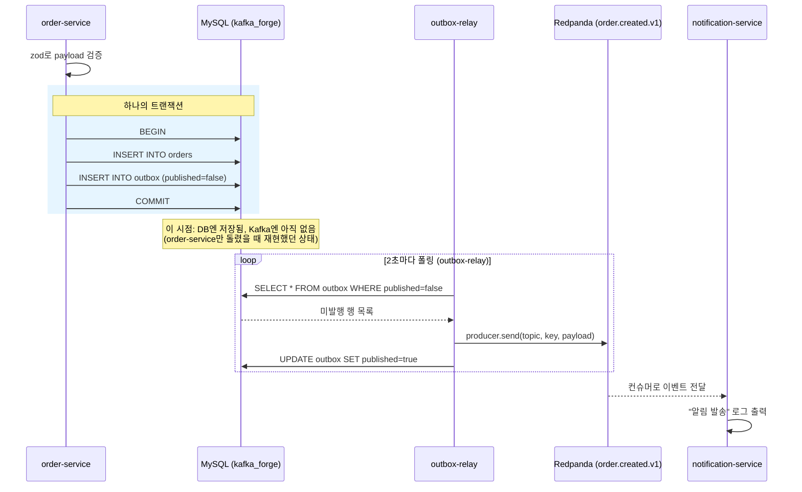

# Phase 4 실습 기록 — Outbox 패턴

DB 트랜잭션 커밋과 Kafka 발행 사이의 정합성 문제를 재현하고, Outbox 패턴으로 해결한 기록.

## 인프라

- 로컬에 이미 떠 있는 MySQL을 사용, `kafka_forge` 전용 DB로 완전히 격리 (다른 프로젝트 DB와 무관)
- 스키마: `scripts/kafka_forge/setup/schema.sql` (사용자가 직접 실행)
- DB 접속 정보는 `.env`(gitignore 처리)로만 관리, 코드/문서에 자격증명 없음

## 사전 준비

```bash
cp .env.example .env   # DB_USER/DB_PASSWORD 직접 채워넣기
npm install
npm run phase4:build-core
```

## 구조 변경

- `order-service`: 더 이상 Kafka에 직접 발행하지 않음. 주문 생성 시 **하나의 트랜잭션**으로 `orders` + `outbox` 테이블에 동시 INSERT만 함
- `outbox-relay`(신규 서비스): `outbox` 테이블에서 `published=false` 행을 2초 간격으로 폴링 → Kafka 발행 → `published=true` 마크
- `kafka-forge` 코어: `OutboxStore` 인터페이스(`fetchPending`/`markPublished`) + `OutboxPublisher`만 추가. MySQL 관련 코드는 전부 `outbox-relay` 쪽에만 있음 (IdempotencyStore와 동일한 패턴)

## 실험 결과

**1) order-service만 단독 실행** (outbox-relay 없이):
```
주문 저장: order-1 (amount=50.33) — outbox에 발행 예약됨
주문 저장: order-2 (amount=18.42) — outbox에 발행 예약됨
주문 저장: order-3 (amount=66.74) — outbox에 발행 예약됨
주문 저장: order-4 (amount=17.4) — outbox에 발행 예약됨
```
DB 확인 결과 `orders`, `outbox` 테이블에 4건 다 저장됐지만 `outbox.published`는 전부 `0` — **DB엔 있는데 Kafka엔 안 나간 상태**가 정확히 재현됨. 이게 Outbox 패턴이 해결하려는 "정합성 문제"의 실물 증거.

**2) outbox-relay + notification-service까지 같이 실행**:
```
Outbox 발행: 4건 처리   ← 아까 쌓여있던 order-1~4를 한 번에 따라잡음
Outbox 발행: 1건 처리
Outbox 발행: 1건 처리
Outbox 발행: 2건 처리
```
notification-service 로그에 `order-1`부터 밀려있던 것까지 전부 정상 수신됨. DB에서도 9건 전부 `published=1`, `published_at`이 실제 발행 시각으로 채워진 것 확인.

## 확인된 개념

- **Outbox 패턴은 "발행 지연"을 대가로 "정합성"을 얻는다.** order-service가 저장한 순간과 실제 Kafka 발행 시점 사이에 폴링 주기(2초)만큼의 지연이 생기지만, 그 사이 프로세스가 죽어도 outbox 테이블에 남아있는 미발행 행은 relay가 재시작되면 그대로 이어서 처리한다 (실제로 outbox-relay를 나중에 띄웠는데도 먼저 쌓인 4건을 놓치지 않고 처리한 것으로 확인).
- **at-least-once가 유지된다**: relay가 Kafka 발행에 성공한 직후, `markPublished` 호출 전에 죽으면 같은 이벤트가 재시작 후 다시 발행될 수 있다. 이건 Phase 3에서 만든 컨슈머 쪽 `IdempotencyStore`가 흡수하는 영역이라 Outbox 자체에서 막지 않는다.
- **kafka-forge 코어는 여전히 특정 DB에 의존하지 않는다.** `OutboxStore` 인터페이스만 알고, MySQL 쿼리는 전부 `outbox-relay` 서비스 코드에만 있다.

## 버그: order-service 재시작 시 order_id 충돌

`orderId`를 `order-${seq++}`로만 만들었더니, `seq`가 프로세스 재시작마다 1부터 다시 시작되는데 `orders.order_id`는 DB에 영구 유니크 제약이 걸려있어서 이전 실행에서 이미 만든 `order-7` 등과 충돌해 `ER_DUP_ENTRY`가 발생했다. Kafka 토픽은 같은 key가 중복돼도 문제없어서 Phase 1~3에서는 안 드러났던 문제.

**수정**: 프로세스 시작 시각 기반 `runId`(`Date.now().toString(36)`)를 orderId 접두어에 포함시켜 `order-${runId}-${seq++}` 형태로 변경, 재시작해도 겹치지 않게 함.

## 다음 단계 (Phase 5 예고)

OTel 분산 트레이싱, Prometheus 메트릭(컨슈머 랙/처리량/에러율), 파티션 수에 따른 처리량 변화 실측으로 넘어간다.

## 플로우


