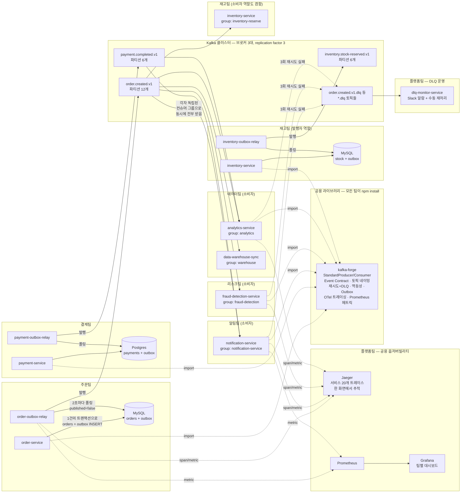

```mermaid
flowchart LR
    subgraph CoreModule["공용 라이브러리 — 모든 팀이 npm install"]
        KafkaForge["kafka-forge<br/>StandardProducer/Consumer<br/>Event Contract · 토픽 네이밍<br/>재시도+DLQ · 멱등성 · Outbox<br/>OTel 트레이싱 · Prometheus 메트릭"]
    end

    subgraph OrderTeam["주문팀"]
        OrderSvc["order-service"]
        OrderDB[("MySQL<br/>orders + outbox")]
        OrderRelay["order-outbox-relay"]
        OrderSvc -->|"1건의 트랜잭션으로<br/>orders + outbox INSERT"| OrderDB
        OrderRelay -->|"2초마다 폴링<br/>published=false"| OrderDB
    end

    subgraph PaymentTeam["결제팀"]
        PaymentSvc["payment-service"]
        PaymentDB[("Postgres<br/>payments + outbox")]
        PaymentRelay["payment-outbox-relay"]
        PaymentSvc --> PaymentDB
        PaymentRelay -->|폴링| PaymentDB
    end

    subgraph InventoryTeamP["재고팀 (발행자 역할)"]
        InventorySvc["inventory-service"]
        InventoryDB[("MySQL<br/>stock + outbox")]
        InventoryRelay["inventory-outbox-relay"]
        InventorySvc --> InventoryDB
        InventoryRelay -->|폴링| InventoryDB
    end

    subgraph KafkaCluster["Kafka 클러스터 — 브로커 3대, replication factor 3"]
        direction TB
        T1["order.created.v1<br/>파티션 12개"]
        T2["payment.completed.v1<br/>파티션 6개"]
        T3["inventory.stock-reserved.v1<br/>파티션 6개"]
        DLQ["order.created.v1.dlq 등<br/>*.dlq 토픽들"]
    end

    OrderRelay -->|발행| T1
    PaymentRelay -->|발행| T2
    InventoryRelay -->|발행| T3

    subgraph NotificationTeam["알림팀 (소비자)"]
        NotiSvc["notification-service<br/>group: notification-service"]
    end

    subgraph FraudTeam["리스크팀 (소비자)"]
        FraudSvc["fraud-detection-service<br/>group: fraud-detection"]
    end

    subgraph DataTeam["데이터팀 (소비자)"]
        AnalyticsSvc["analytics-service<br/>group: analytics"]
        WarehouseSync["data-warehouse-sync<br/>group: warehouse"]
    end

    subgraph InventoryTeamC["재고팀 (소비자 역할도 겸함)"]
        InventoryConsumer["inventory-service<br/>group: inventory-reserve"]
    end

    T1 -->|"각자 독립된<br/>컨슈머 그룹으로<br/>동시에 전부 받음"| NotiSvc
    T1 --> FraudSvc
    T1 --> AnalyticsSvc
    T1 --> WarehouseSync
    T1 --> InventoryConsumer
    T2 --> NotiSvc
    T2 --> AnalyticsSvc

    NotiSvc -.3회 재시도 실패.-> DLQ
    FraudSvc -.3회 재시도 실패.-> DLQ
    AnalyticsSvc -.3회 재시도 실패.-> DLQ

    subgraph DLQOps["플랫폼팀 — DLQ 운영"]
        DLQMonitor["dlq-monitor-service<br/>Slack 알람 + 수동 재처리"]
    end
    DLQ --> DLQMonitor

    subgraph Observability["플랫폼팀 — 공용 옵저버빌리티"]
        Jaeger["Jaeger<br/>서비스 20개 트레이스<br/>한 화면에서 추적"]
        Prometheus["Prometheus"]
        Grafana["Grafana<br/>팀별 대시보드"]
    end

    OrderRelay -.span/metric.-> Jaeger
    NotiSvc -.span/metric.-> Jaeger
    FraudSvc -.span/metric.-> Jaeger
    AnalyticsSvc -.span/metric.-> Jaeger
    OrderRelay -.metric.-> Prometheus
    NotiSvc -.metric.-> Prometheus
    Prometheus --> Grafana

    OrderSvc -.import.-> KafkaForge
    PaymentSvc -.import.-> KafkaForge
    InventorySvc -.import.-> KafkaForge
    NotiSvc -.import.-> KafkaForge
    FraudSvc -.import.-> KafkaForge
    AnalyticsSvc -.import.-> KafkaForge
```
